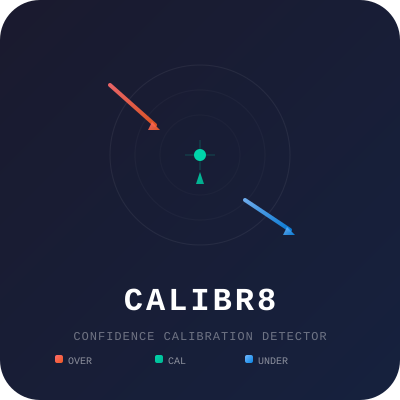

<p align="center">
  <picture>
    <source media="(prefers-color-scheme: dark)" srcset="assets/logo.svg">
    
  </picture>
</p>

# Calibr8

A ~4B parameter model (Qwen3-4B-Instruct + LoRA) fine-tuned to classify text by confidence calibration.

Given any claim or statement, it detects whether the language is:

| Label | Meaning |
|-------|---------|
| **OVERCLAIMING** | Certainty exceeds the evidence (e.g. "Studies definitively prove…") |
| **UNDERCLAIMING** | Excessive hedging where evidence is actually strong (e.g. "Some researchers suggest…") |
| **CALIBRATED** | Expressed certainty matches the evidence (e.g. "A 2023 RCT found…") |

**Secondary outputs:** confidence score (0–1) and the specific miscalibrated phrase (span).

## Metrics

| Metric | Score | Target |
|--------|-------|--------|
| Macro F1 | **0.736** | >0.72 |
| OVERCLAIMING F1 | 0.707 | >0.75 |
| UNDERCLAIMING F1 | **0.886** | >0.60 |
| CALIBRATED F1 | 0.616 | >0.75 |
| Accuracy | 73.0% | — |

Trained on 218K records from LIAR-PLUS, AVeriTeC, SciFact, HealthVer, ClaimBuster, FEVER, and YMETHO, with rule-based synthetic augmentation for class balance.

## Requirements

- Apple Silicon Mac (M1–M4) with ≥16 GB unified memory
- Python 3.11+

```bash
pip install mlx-lm numpy
```

## Usage

```bash
# Download Calibr8 adapter
pip install huggingface-hub
huggingface-cli download Bonhollow/calibr8 --local-dir adapters/calibr8
```

```python
from mlx_lm import load, generate

model, tokenizer = load(
    "mlx-community/Qwen3-4B-Instruct-2507-4bit-g32",
    adapter_path="adapters/calibr8"
)

def classify(text: str) -> str:
    messages = [{"role": "user", "content": text}]
    prompt = tokenizer.apply_chat_template(messages, tokenize=False)
    response = generate(model, tokenizer, prompt=prompt, max_tokens=40)
    return response

print(classify("Studies prove this cures inflammation."))
# OVERCLAIMING (0.78). The claim expresses confidence that exceeds what the evidence supports. Span: "proven"
```

### CLI

```bash
python3 scripts/classify.py "Studies prove this cures inflammation."
```

Output:
```json
{
  "label": "OVERCLAIMING",
  "confidence": 0.78,
  "span": "proven",
  "explanation": "The claim expresses confidence that exceeds what the evidence supports."
}
```

## Training

Fine-tuned with MLX LoRA (rank 16, 16 layers, 7.34M trainable params = 0.182% of 4B).

- **Base model:** Qwen3-4B-Instruct-2507 (4-bit quantized, group size 32)
- **Data:** 43K balanced training records from 7 public datasets
- **Augmentation:** Rule-based synthetic UC/OC examples from CAL sentences
- **Hardware:** M3 Max, ~4 hours train time, <4 GB peak memory

## Dataset Sources

| Source | Records | Domain |
|--------|---------|--------|
| FEVER | 145K | Wikipedia claims |
| YMETHO | 17K | Central bank minutes |
| HealthVer | 14K | Health claims |
| LIAR-PLUS | 12K | Political statements |
| ClaimBuster | 23K | News sentences |
| AVeriTeC | 3.5K | General claims |
| SciFact | 1.4K | Scientific claims |

## Limitations

- Best on English text from formal/institutional sources (news, science, politics, finance)
- UNDERCLAIMING detection relies on explicit hedging patterns; subtle or domain-specific hedging may be missed
- ~2s/sample on M3 Max; not optimized for real-time production
- Confidence scores are heuristic-based, not true model probabilities

## License

MIT

---

```
license: mit
language: en
tags: confidence-calibration, mlx, qwen, classification, overclaiming, hedging
pipeline_tag: text-classification
library_name: mlx
```
